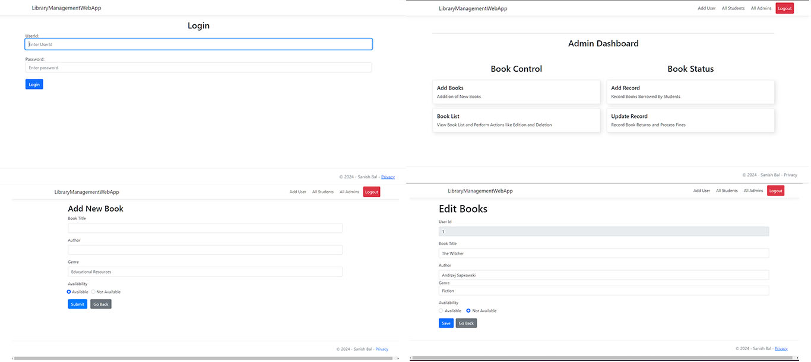
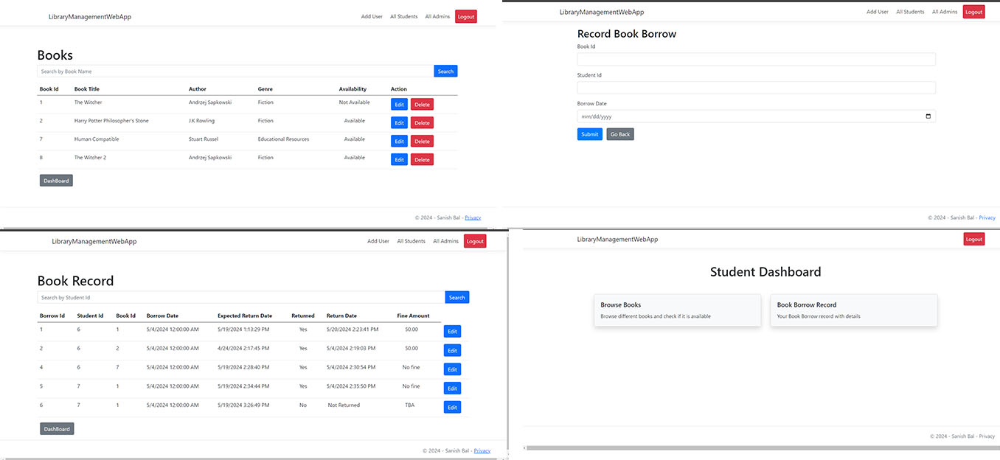

# Library Management Web App

A Library Management Web Application built with ASP.Net 8 MVC model using SQl Server 2022 as database.

## Features

- **User Management**: Manage students and administrators.
- **Book Management**: Add, remove, and update books in the library.
- **Borrowing System**: Track borrowed books and due dates  with fines if due date exceeds.
- **Search Functionality**: Search for books or students by name.
- **Role-Based Access Control**: Different roles for students and administrators and  acess accoeding to role.

##Some Pictures

